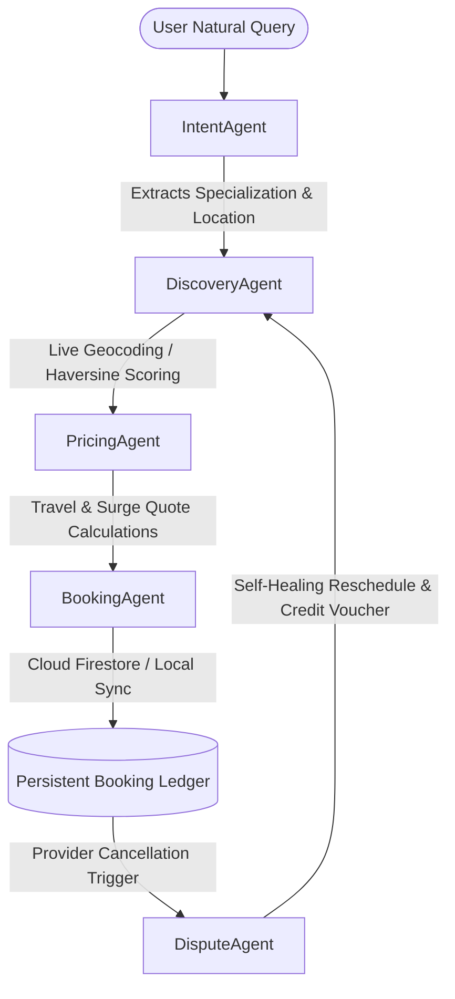

# Hamara-Rozgar (RozgarOrch) 🛠️
### Challenge 2: AI Service Orchestrator for Informal Economy - Google Antigravity Hackathon

**Hamara-Rozgar (RozgarOrch)** is a premium, agentic, AI-driven marketplace orchestrator designed to solve fragmentation in Pakistan's informal economy. By bridging the digital divide for daily wage workers (plumbers, electricians, tutors, AC technicians, beauticians, mechanics), this solution automates the end-to-end booking lifecycle. It parses multi-turn conversational queries across Urdu, Roman Urdu, and English, executes proximity matching, performs travel-adjusted pricing, registers persistent transactions, and resolves real-time anomalies.

The implementation features an interactive **Smartphone Simulator**, a **Marketplace Control Center**, and a live **Google Antigravity Agent Trace Console** displaying step-by-step reasoning processes and API payload interactions.

---

## 🏛️ System Architecture

Our solution is built on a **Decoupled Multi-Agent Cooperative Pipeline**. Rather than a monolithic model, tasks are delegated to specialized micro-agents that communicate parameters sequentially and react dynamically to operational state updates:



### The 5 Cooperative micro-agents:
1. **IntentAgent (Multilingual Parsing & Context Memory)**:
   * Extracts target specialization and location parameters across English, formal Urdu script, and colloquial Roman Urdu slang (e.g., *"yar AC kaam nahi kr rha thanda"*).
   * Fully integrates **Google AI Studio's Gemini 1.5 Flash** for structured JSON parsing.
   * Maintains multi-turn context memory (e.g. if the user says *"puncture lagwana hai"* and follows up with *"main airport society me hu"*, the intent preserves the context cleanly).
   * Incorporates an offline high-fidelity regex-based dictionary lookup for zero-downtime fallback.

2. **DiscoveryAgent (Proximity & Workload Optimizer)**:
   * Fetches active provider grids. Connects directly to browser GPS Geolocation coordinates on startup.
   * If a custom address is specified, it queries the **Google Geocoding API** to resolve precise coordinate vectors on-the-fly.
   * Scores and ranks matching specialists using a **6-Factor Utility Function**:
     $$\text{Utility} = (d \times 0.25) + (R \times 0.20) + (L \times 0.20) + (P \times 0.15) + (C \times 0.10) + (S \times 0.10)$$
     *(Where $d$ = distance, $R$ = rating, $L$ = reliability score, $P$ = price match, $C$ = cancellation rate, $S$ = sector matching).*

3. **PricingAgent (Dynamic Cost Generator)**:
   * Formulates transparent billing invoices consisting of:
     * **Base Rate:** The standard benchmark service fee.
     * **Travel Allowance:** Multiplied dynamically by coordinate distance (50 PKR/km).
     * **Urgency Surcharge:** +30% weight for immediately requested task cards.
     * **Surge Surplus:** +15% dynamic surcharge if active provider capacity is constrained.
     * **Loyalty Discount:** -10% deduction automatically applied to retain repeat clients.

4. **BookingAgent (Persistent Transaction Ledger)**:
   * Syncs active transaction records with **Firebase Cloud Firestore**.
   * Integrates a robust offline fallback to a reactive local cache storage in case database connections are pending, ensuring uninterrupted user interactions.

5. **DisputeAgent (Self-Healing Fallback Engine)**:
   * Intercepts post-booking real-time anomalies (such as a provider cancelling en-route).
   * Automatically launches a new discovery query, re-assigns the job card to the next-best provider, issues an automated 150 PKR voucher credit to the client, and penalizes the cancelling provider's reliability index.

---

## 🔌 API Integrations & Payload Schemas

Hamara-Rozgar combines real-world cloud services with resilient mock fallbacks:

### 1. Google Gemini Developer API (Real-Time NLP)
Communicates directly with Google AI Studio's LLM to generate structured JSON outputs:
* **Endpoint:** `POST https://generativelanguage.googleapis.com/v1beta/models/gemini-1.5-flash:generateContent?key={API_KEY}`
* **Request Payload Structure:**
```json
{
  "contents": [
    {
      "role": "user",
      "parts": [{ "text": "yaar kitchen me paani beh rha hai urgent G-11 me plumber bhej do" }]
    }
  ],
  "system_instruction": {
    "parts": [{ "text": "Parse inputs into JSON: { service: Plumber|Electrician|..., location: string|null, urgency: boolean }" }]
  },
  "generationConfig": {
    "responseMimeType": "application/json"
  }
}
```

### 2. Google Geocoding API (Real-Time Address Mapping)
Converts human sector and colony names to precise geocodes:
* **Endpoint:** `GET https://maps.googleapis.com/maps/api/geocode/json?address={LocationName},Islamabad,Pakistan&key={API_KEY}`
* **Response Output:** Extracts `results[0].geometry.location` (`lat`/`lng`) dynamically.

### 3. Firebase Cloud Firestore (Real-Time Storage)
Synchronizes transactional statuses across client states:
* **Schema Definition:**
```json
{
  "id": "BK-7041",
  "clientLocation": "Sector G-11, Islamabad",
  "clientCoords": { "latitude": 33.6821, "longitude": 72.9896 },
  "providerName": "Sajid AC Repairs",
  "service": "AC Technician",
  "pricing": { "basePrice": 1200, "travelFee": 150, "totalPrice": 1350 },
  "status": "Provider En-Route"
}
```

---

## 🌟 Premium Design Aesthetics

The interface is built completely on **Vanilla CSS** (zero external bloated styling dependencies) optimized for responsive, publication-grade aesthetics:
* **Smartphone Simulator:** A floating glassmorphic simulator replicating a high-end native mobile environment with en-route progress maps and quick Urdu slang suggestion chips.
* **Antigravity Trace Console:** Exposes micro-agent reasoning steps, active plans, sub-agent weights, database writes, and API responses.
* **Marketplace Control Center:** Coordinates active provider accounts, balances, and hosts input panels for custom Gemini and Maps API keys.

---

## 📦 Mobile App Compilation (Capacitor)

The project includes a pre-configured native wrapper directory (`android/`) scaffolding standard Gradle environments. 

To easily compile this web application into a native standalone **Android APK** without needing manual Android Studio setup, run our double-click executable scripts in the root directory:
* **Linux/macOS:** Run `./build_apk.sh` in your terminal.
* **Windows:** Double-click the file `build_apk.bat`.

The compiler will automatically bundle React, synchronize native Capacitor resources, and execute Gradle to generate the standalone installer package at:
`android/app/build/outputs/apk/release/app-release-unsigned.apk`

---

## 🚀 Installation & Local Run

1. Navigate to the project root and install all node packages:
   ```bash
   cd service-orchestrator
   npm install
   ```
2. Start the local Vite server:
   ```bash
   npm run dev
   ```
3. Open `http://localhost:5173` in your browser.
4. **Demo Flow:**
   * Paste a valid Gemini API Key in the left Settings card to see the badge transition to green (`Gemini NLP active`).
   * Type: *"yaar AC bilkul thanda nhi kar rha G-13 me"* in the phone chat interface.
   * Watch the Discovery Agent lock coordinates, scoring aliased provider arrays in real-time, and dispatch the en-route tracker card!
